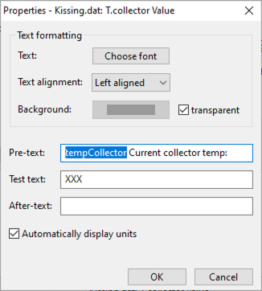
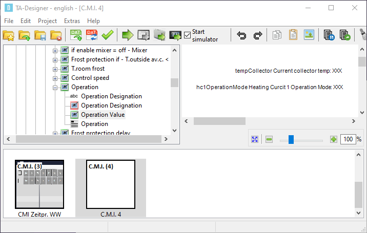
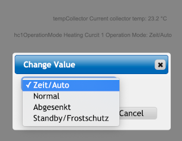

# TA C.M.I. Binding

This binding makes use of the CAN over Ethernet feature of the C.M.I. from Technische Alternative.
Since I only have the new UVR16x2, it has only been tested with this controller.

The binding supports two ways to interact with the C.M.I. and all devices connected to the C.M.I. via the CAN bus.
These modes are:


Via a "Schema API Page"
  * Read values from output nodes
  * Change values for controllable nodes

CoE (CAN over Ethernet) Connection
  * Receive data from analog CAN-outputs defined in TAPPS2
  * Receive data from digital CAN-outputs defined in TAPPS2
  * Send ON/OFF to digital CAN-inputs defined in TAPPS2
  * Send numeric values to analog CAN-inputs defined in TAPPS2


Depending on what you want to achieve, either the "Schema API Page" or the CoE way might be better.
As rough guidance: Anything you want to provide to the TA equipment it has to work / operate with the CoE might be better.
If you plan things mainly for user interaction the "Schema API Page" might be better.


## Prerequisites

### Setting up the "Schema API Page"

The "Schema API page" is a special schema page created via TA's *TA-Designer* application available as download on their web site.
This page just needs to exist and be deployed on the C.M.I. but it dosn't need to be linked by the other schema pages you are using to control your TA installation.

All objects from this special 'API' page are automatically mapped as channels of this thing, so the labels of the objects on this page have to follow a specific schema.

When adding objects to this page, the schema for the Object's *Pre-Text* field has to follow the schema `<channelName> <channel description>: `.

Maybe this screenshot shows it best:



The Text from the *Pre-Text* will be used to define the channel.
The first word *tempCollector* (highlighted in the screenshot) will be used as channel name, so it has to be unique.
Everything else till the final *:* will be used as channel description.
The type of the channel will be automatically determined by the type of the object added.
The first sample is a sensor reading, but also the 'operation mode' of a heating circuit could be added:



In this screenshot you also see the schema page id - the parenthesized number on the bottom page overview, in this sample 4.

### CoE Configuration

#### Configure CAN outputs in TAPPS2

You need to configure CAN outputs in your Functional data on the UVR16x2.
This can be done by using the TAPPS2 application from TA. Follow the user guide on how to do this.

#### Configure your CMI for COE

Now follow the User Guide of the CMI on how to setup CAN over Ethernet (COE).
Here you will map your outputs that you configured in the previous step.
This can be accomplished via the GUI on the CMI or via the coe.csv file.
As the target device you need to put the IP of your openHAB server.
Don’t forget to reboot the CMI after you uploaded the coe.csv file.

## Supported Bridge and Things

* TA C.M.I. schema API connection - Thing

This thing reflecting one of our 'schema API page' as defined in the prerequisites.
This thing doesn't need the bridge.
Multiple of these pages on different C.M.I.'s could be defined within a OH instance.

* TA C.M.I. CoE Bridge

In order to get the CAN over Ethernet (COE) envionment working a `coe-bridge` has to be created.
The bridge itself opens the UDP port 5441 for communication with the C.M.I. devices.
The bridge could be used for multiple C.M.I. devices.

* TA C.M.I. CoE Connection - Thing

This thing reflects a connection to a node behind a specific C.M.I..
This node could be every CAN-Capable device from TA which allows to define an CAN-Input.

## Discovery

Autodiscovering is not supported. We have to define the things manually.

## Thing Configuration

### TA C.M.I. schema API connection

The _TA C.M.I. Schema API Connection_ has to be manually configured.

The thing has the following configuration parameters:

| Parameter Label         | Parameter ID | Description                                                                                                   | Accepted values        |
|-------------------------|--------------|---------------------------------------------------------------------------------------------------------------|------------------------|
| C.M.I. IP Address       | host         | Host name or IP address of the C.M.I                                                                          | host name or ip        |
| Username                | username     | Username for authentication on the C.M.I.                                                                     | string with username   |
| Password                | password     | Password for authentication on the C.M.I.                                                                     | string with password   |
| API Schema ID           | schemaId     | ID of the schema API page                                                                                     | 1-256                  |
| Poll Interval           | pollInterval | Poll interval (in seconds) how often to poll the API Page                                                     | 1-300; default 10      |

This thing doesn't need a bridge. Multiple of these things for different C.M.I.'s could be defined within a OH instance.

### TA C.M.I. CoE Connection

The _TA C.M.I. CoE Connection_ has to be manually configured.

This thing reflects a connection to a node behind a specific C.M.I.. This node could be every CAN-Capable device from TA which allows to define an CAN-Input.

| Parameter Label         | Parameter ID    | Description                                                                                                   | Accepted values        |
|-------------------------|-----------------|---------------------------------------------------------------------------------------------------------------|------------------------|
| C.M.I. IP Address       | host            | Host name or IP address of the C.M.I                                                                          | host name or ip        |
| Node                    | node            | The CoE / CAN Node number openHAB should represent                                                            | 1-64                   |
| Persistence Interval    | persistInterval | Mode (-1: during shutdown only; 0: disabled) and interval (in s) for persisting thing states                  | -1 - 3600; 0: disabled (default); -1: during binding shutdown only; >0: interval in seconds |

A few words to the Persistence Interval:
You have to enable / set it properly when send values from OH -> TA C.M.I. and the value are ciritical for the TA's programming.
As you might already have taken notice when studing the TA's manual, there are always a multpile CoE-values updated withinin a single CoE-message.
This is a design decision made bei TA.
But this also means for CoE-Messages from OH to TA C.M.I. we have to send multiple values at once.
But due to OH's design there is no default restore of previous values out of the box.
This binding implements a own persistance mechanism to save the last known values to have them available after startup of the binding, so we could provide consistent values to TA.
But as most installations are running on Flash-Cards with limitied write cycles, this feature is disabled by default and you have to enable it when needed.
When it is disabled, the binding will send out updates when _output thing cahnnels_ are updated, but 'zero out' all other output channels where the binding dosn't have a valid value yet.
Beside the persistence service, you also have the option to use _CoE Value Validation_ on the TA side to detect invalid values or just to use only every 4th analog and 16th digital channel if this is enough for you.

The thing has no channels by default - they have to be added manually matching the configured inputs / outputs for the related CAN Node. Digital and Analog channels are supported. Please read TA's documentation related to the CAN-protocol - multiple analog (4) and digital (16) channels are combined so please be aware of this design limitation.

## Channels

### TA C.M.I. schema API connection

The channels provided by this thing depends on the configuration of the "schema API page".
All the channels are dynamically created to match it.
Also when the API Page is updated, the channels are also updated during the next refresh.

### TA C.M.I. CoE Connection

Supported channels for the CoE connection are:

| channel         | type        | description                                                          |
|-----------------|-------------|----------------------------------------------------------------------|
| coe-digital-in  | Switch (RO) | Digital input channel for digital state data received from the node  |
| coe-digital-out | Switch      | Digital output channel for digital state data sent to the node       |
| coe-analog-in   | Number (RO) | Analog input channel for numeric values received from the node       |
| coe-analog-out  | Number      | Analog output channel for numeric values sent to the node            |

Each channel has an _output id_ as configuration.
Output ID's are in range from 1 to 64. For `coe-analog-out` also a measurment type has to be configured so the C.M.I. / Receiving node know's how to handle / interpret the value.
The binding will also do some conversion depending on the measurment type.
For `coe-analog-in` channels the measurement type is received with the value and so the conversion is automatically applied.

The binding supports all 21 measure types that exist according to the TA documentation. Unfortunately, the documentation is not consistent here, so most of the types are supported only by generic names.
The known measure types are:

| id     | type          | description                                   |
|--------|---------------|-----------------------------------------------|
| 1      | Temperature   | Tempeature value. Value is multiplied by 0.1  |
| 2      | Unknown2      |                                               |
| 3      | Unknown3      |                                               |
| 4      | Seconds       |                                               |
| 5...9  | Unknown5..9   |                                               |
| 10     | Kilowatt      |                                               |
| 11     | Kilowatthours |                                               |
| 12     | Megawatthours |                                               |
| 13..21 | Unknown       |                                               |


## Full Example

As there is no common configuration as everything depends on the configuration of the TA devices.
So we just can provide some samples providing the basics so you can build the configuration matching your system.

Example of a _.thing_ file:

```
Thing tacmi:cmiSchema:apiLab "CMIApiPage"@"lab" [ host="192.168.178.33", username="user", password="secret", schemaId=4 ]
Bridge tacmi:coe-bridge:coe-bridge "TA C.M.I. Bridge"
{

    Thing cmi cmiTest "Test-CMI"@"lab" [ host="192.168.178.33", node=54 ] {
    Channels:
        Type coe-digital-in : digitalInput1 "Digital input 1" [ output=1 ]
        Type coe-digital-out : digitalOutput1 "Digital output 1" [ output=1 ]
        Type coe-analog-in : analogInput1 "Analog input 1" [ output=1 ]
        Type coe-analog-out : analogOutput1 "Analog output 1" [ output=1, type=1 ]
    }

}
```

Sample _.items_-File:

```
# APIPage-items
Number TACMI_Api_tempCollector "Collector temp [%.1f °C]" <temperature> {channel="tacmi:cmiSchema:apiLab:tempCollector"}
String TACMI_Api_hc1OperationMode "Heating Curcuit 1 Operation Mode [%s]" {channel="tacmi:cmiSchema:apiLab:hc1OperationMode"}


# COE-items
Number TACMI_Analog_In_1     "TA input value 1 [%.1f]"  <temperature> {channel="tacmi:cmi:coe-bridge:cmiTest:analogInput1"}
Number TACMI_Analog_Out_1    "TA output value 1 [%.1f]" <temperature> {channel="tacmi:cmi:coe-bridge:cmiTest:analogOutput1"}
Switch TACMI_Digital_In_1    "TA input switch 1 [%s]"    {channel="tacmi:cmi:coe-bridge:cmiTest:digitalInput1"}
Switch TACMI_Digital_Out_1   "TA output switch 1 [%s]"   {channel="tacmi:cmi:coe-bridge:cmiTest:digitalOutput1"}
```

Sample _.sitemap_ snipplet

```
sitemap heatingTA label="heatingTA"
{
    Text item=TACMI_Api_tempCollector
    Switch item=TACMI_Api_hc1OperationMode mappings=["Zeit/Auto"="Auto", "Normal"="Operating", "Abgesenkt"="lowered", "Standby/Frostschutz"="Standby"]

    Text item=TACMI_Analog_In_1
    Setpoint item=TACMI_Analog_Out_1 step=5 minValue=15 maxValue=45
    Switch item=TACMI_Digital_In_1
    Switch item=TACMI_Digital_Out_1
}
```

## Any custom content here!

Some additional hints and comments:

You might already have noticed that some state information is in German.
As I have set the `Accept-Language`-Http-Header to `en` for all request and found no other way setting a language for the schema pages I assume it is a lack of internationalization in the C.M.I.
You could circumvent this by creating map files to map things properly to your language.

If you want to see the possible options of a multi-state field you could open the *schema API page* with your web browser and click on the object.
A Popup with an option field will be shown showing all possible options, like in this screenshot:



Please be also aware that there are field having more 'state' values than options, i.E. a manual output override: It has 'Auto/On', 'Auto/Off', 'Manual/On', 'Manual/Off' as state, but only 'Auto', 'Manual/On' and 'Manual/Off' as updateable option.
You only set it to 'Auto' and the extension On/Off is added depending on the system's current state.


Finally - It would be great to hear from your projects and ideas / solutions!
